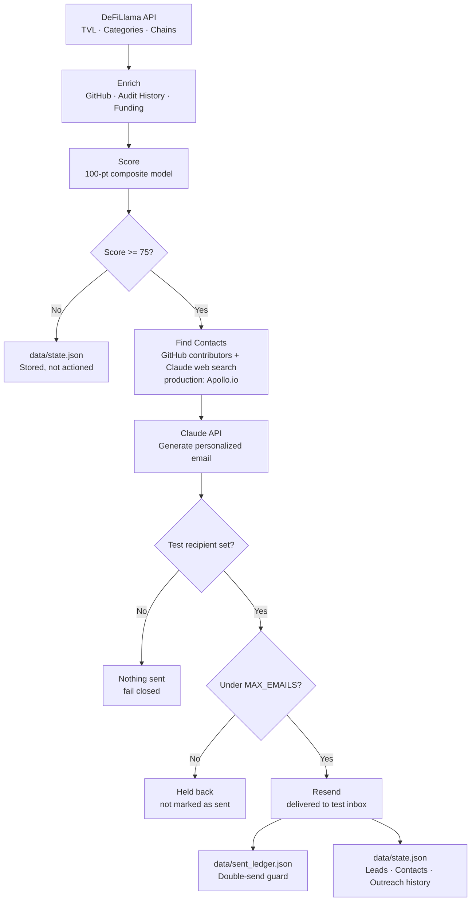
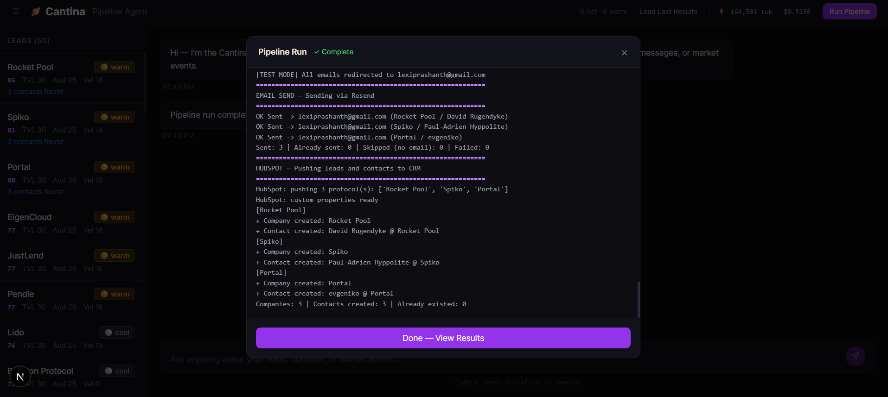
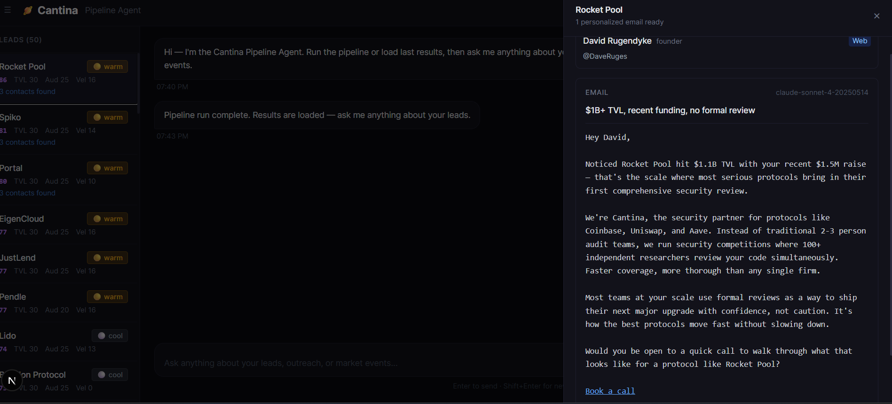
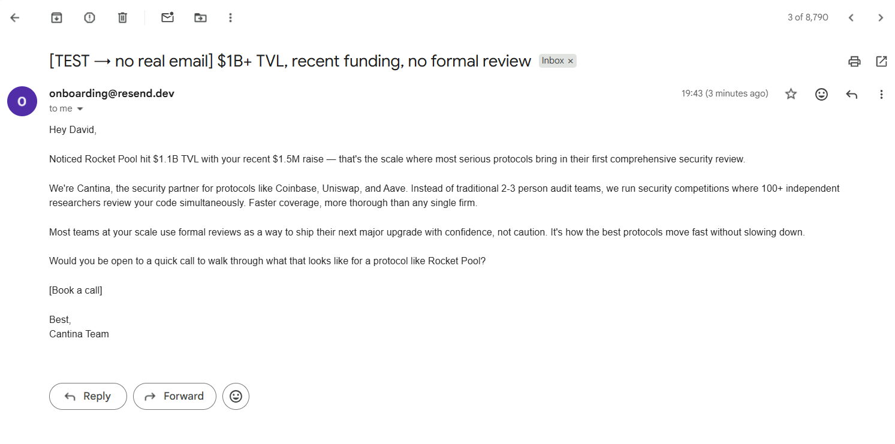

# Discovery Pipeline

An AI-powered GTM pipeline for Web3 security sales. It discovers protocols from live
data, scores them against a configurable ICP, finds the people worth contacting, writes a
personalized cold email for each with Claude, and sends it — with two hard safety gates in
front of every send.

Everything persists to a local JSON file. There is no database, no CRM, and no Slack
integration to set up: clone it, add two API keys, and run it.

---

## Live Demo

**[View it live →](https://your-project.vercel.app)** *(add your URL after deploying)*

- **Frontend:** Next.js on Vercel
- **API:** FastAPI + uvicorn on Render
- **Data:** a real pipeline run — 58 protocols scored, 18 contacts found, 3 emails written by Claude

The chat agent on the live site is the real LangChain agent making real Claude tool
calls against the deployed API. Pipeline runs are disabled in production because they
spend credits and can send email; the code path is the same one that produced the data
on screen.

Setup, and the failure modes worth knowing about, are in [DEPLOY.md](DEPLOY.md).

---

## The Hypothesis

Web3 engineering teams are using Copilot, Cursor, and Claude Code to write Solidity and Rust smart contracts faster than ever. But AI-generated smart contract code is uniquely dangerous — a single vulnerability means **immediate, irreversible loss of funds**. Traditional audit cycles can't keep pace with AI-accelerated shipping. A security platform — combining continuous AI code analysis, a large independent researcher network, competitions, and bug bounties — is built for this velocity.

**Why Hypothesis A over B:** Hypothesis A is a survival problem (get exploited or don't). Hypothesis B (tool consolidation) is an efficiency problem. Urgency books discovery calls.

---

## What It Does

1. **Ingest** — Pulls live protocol data from DeFiLlama (TVL, categories, chains)
2. **Enrich** — Fetches GitHub activity, audit history, funding, and team signals
3. **Score** — Weighted composite scoring across 5 signals (TVL, audit status, shipping velocity, funding recency, reachability)
4. **Contact enrichment** — Finds founders, CTOs, and security leads via GitHub contributors + Claude web search
5. **Outreach** — Generates personalized cold emails via Claude API, one per person found
6. **Send** — Delivers emails via Resend
7. **Persist** — Saves leads, contacts, and outreach history to `data/state.json`



---

## Architecture

```
discovery-pipeline/
├── frontend/              Next.js UI — chat + lead dashboard + draft drawer
├── scripts/
│   ├── api.py             FastAPI backend — all REST endpoints + LangChain agent
│   └── run_pipeline.py    Standalone CLI pipeline runner
├── src/
│   ├── pipeline/          ingest → enrich → score
│   ├── agents/            outreach_agent.py (Claude email generation + templates)
│   ├── integrations/      email_sender.py, contacts.py
│   ├── monitoring/        event_monitor.py (DeFiLlama exploit/funding detection)
│   ├── store/             json_store.py (data/state.json + send ledger)
│   └── utils/             claude_client.py, config.py, json_utils.py, token_tracker.py
├── config/
│   ├── scoring_weights.json   ICP definition — all scoring rules and discovery settings
│   └── .env.example           API keys and secrets template
├── data/                  state.json + sent_ledger.json (gitignored, created on first run)
└── docs/
    └── images/               Screenshots of the working system
```

---

## Tech Stack

| Layer | Technology |
|-------|-----------|
| Pipeline | Python 3.11+ |
| Web API | FastAPI + Uvicorn |
| Frontend | Next.js 14 (App Router) + Tailwind |
| AI / LLM | Claude API (Anthropic SDK) |
| Agents | LangChain tool-calling agent |
| Email | Resend |
| Monitoring | DeFiLlama hacks/funding APIs |
| Persistence | `data/state.json` (atomic writes, no DB) |

---

## Scoring Model

100-point composite score across 5 signals:

| Signal | Max pts | Logic |
|--------|---------|-------|
| TVL / funds at risk | 30 | >$1B = 30, $100M–$1B = 25, $10M–$100M = 20 |
| Audit status | 25 | Never audited = 25, stale = 22, shipping unaudited code = 20 |
| Shipping velocity | 20 | Daily commits + weekly deploys = 16, plus up to 4 for AI tool signals |
| Funding recency | 15 | Raised in last 3 months = 15 |
| Reachability | 10 | Warm intro = 10, doxxed + active Twitter = 8 |

**Tiers:** Hot ≥ 90 · Warm 75–89 · Cool < 75

Every point value lives in `config/scoring_weights.json`. `score.py` reads all of them by key
and hardcodes nothing, so editing that file genuinely changes scoring — drop
`tvl_100m_to_1b` to 5 and every mid-cap protocol falls a tier, with no code change.

The **AI tool signal bonus** (`+2` per detected `.cursorrules` / Copilot config, max `+4`) is
the one that encodes the hypothesis: between two protocols shipping at the same rate, the one
visibly using AI to write contracts scores higher.

---

## Setup

### 1. Python dependencies

```bash
cd discovery-pipeline
pip install -r requirements.txt
```

### 2. Environment variables

```bash
cp config/.env.example config/.env
# Fill in your keys
```

Five keys, and only two are needed to see the pipeline run end to end:

| Key | Needed for |
|-----|-----------|
| `ANTHROPIC_API_KEY` | **Required.** Outreach generation and contact search |
| `RESEND_API_KEY` | Sending email. Without it the pipeline still scores, finds contacts, and drafts |
| `RESEND_FROM_EMAIL` | Sender address on a Resend-verified domain |
| `RESEND_TEST_EMAIL` | The inbox every email is redirected to. **No value here and none in the UI means nothing is sent** |
| `GITHUB_TOKEN` | Optional. Raises the GitHub rate limit from 60 to 5000 req/hr |

No database URL, no CRM token, no webhook. `DEFILLAMA_BASE_URL`, `ANTHROPIC_MODEL`, and
`MAX_EMAILS` are also read from the environment if set, but all three have working defaults.

---

### 3. Frontend

```bash
cd discovery-pipeline/frontend
npm install
npm run dev
```

### 4. Backend API

```bash
uvicorn scripts.api:app --port 8000 --reload
```

Once running, the interactive API docs are available at `http://localhost:8000/docs` — all endpoints are listed and callable directly from the browser.

---

## Sending Emails Safely

Two hard limits sit in front of every send. Neither can be bypassed by a caller —
both are enforced inside `send_outreach_emails()`.

### 1. Everything goes to one test inbox

Outreach is **never** delivered to the real discovered contacts. Every email is
redirected to a single test recipient:

- Set it in the UI header field **"Send test emails to:"** (defaults to
  `prashanthtalwarr@gmail.com` — **replace this with your own address** so the
  emails land somewhere you can check). The value is remembered in your browser.
- Or set `RESEND_TEST_EMAIL` in `config/.env` as the fallback.
- On the CLI: `python scripts/run_pipeline.py --test-email you@example.com`

**If neither is set, nothing is sent at all.** The run completes, drafts are
generated and saved, and the send step reports `no test recipient set` — it does
not fall through to real prospects.

Each redirected email keeps the intended recipient visible in two places, so you
can tell who it was written for:

- the subject, prefixed `[TEST -> ada@protocol.xyz] ...`
- a banner at the top of the body naming the person, their role, and their protocol

> Note: Resend only delivers to arbitrary addresses once you have verified a
> sending domain. Until then it restricts sends to your own account email — which
> is exactly what this test-recipient setup is for.

### 2. A hard cap on emails per run

`MAX_EMAILS` (default **5**) is the ceiling on how many emails one run may
deliver. Precedence: `--max-emails` flag → `MAX_EMAILS` env var →
`discovery.max_emails_per_run` in `config/scoring_weights.json` → 5.

- Only real sends count against the budget. Drafts skipped because the person was
  already emailed, or had no address, do not consume it.
- Drafts held back by the cap are reported as `skipped` with reason
  `max_emails cap reached` — never silently dropped — and are **not** written to
  the send ledger, so they can go out on a later run.

With the current config (`max_qualified_leads: 3`, one contact per protocol) at
most 3 emails are generated per run, so the 5-email cap is a backstop rather than
something you will hit day to day. Raise `max_qualified_leads` to make it bite.

---

## Running the Pipeline

Open `http://localhost:3000`, put your own address in the **Send test emails to:** field, and
click **Run Pipeline**. Progress streams into a modal as it runs.

A run scores up to 50 protocols, qualifies the top 3, finds contacts for those, and sends at
most 5 emails — all to your test inbox. The CLI does the same thing:

```bash
python scripts/run_pipeline.py --test-email you@example.com
python scripts/run_pipeline.py --seed-only --no-llm    # no API calls at all
```

| URL | What it is |
|-----|-----------|
| `http://localhost:3000` | Next.js UI — lead dashboard, chat agent, draft drawer |
| `http://localhost:8000/docs` | FastAPI interactive docs — all REST endpoints |

### Testing a Reply

To simulate a prospect replying, use the `POST /api/outreach/replied` endpoint directly from `http://localhost:8000/docs`:

```json
{
  "protocol_name": "Ethena",
  "persona_name": "Guy Young",
  "reply_body": "Thanks for reaching out, happy to chat."
}
```

This does one thing:
1. **`data/state.json`** — outreach status updated to `replied`, with the reply body stored alongside the original message

### Pipeline Results



### Email Drafted



### Email Delivered



---

## Chat Agent

The UI includes a LangChain-powered agent (Claude) with tools:

| Tool | What it does |
|------|-------------|
| `get_pipeline_results` | List scored leads with tier filter |
| `get_outreach_draft` | Show all drafted emails for a protocol |
| `get_pipeline_summary` | High-level counts and top leads |
| `get_contacts` | Show contacts found for a protocol |
| `run_market_monitor` | Check DeFiLlama for exploits and funding rounds |

---

## Configuration

All ICP and scoring settings are in `config/scoring_weights.json`:

```json
"discovery": {
  "min_tvl_usd": 50000000,
  "max_protocols_per_run": 50,
  "max_qualified_leads": 3,
  "max_contacts_per_protocol": 3,
  "max_emails_per_run": 5,
  "target_categories": ["Dexes", "Lending", "Yield", "..."]
}
```

`max_qualified_leads` is held at 3 to keep Claude costs down during a demo — raise it and let
the score threshold do the filtering. `max_emails_per_run` is independent of it: it is the
hard ceiling at the send step, so raising lead volume can never quietly raise email volume.

---

## Token Tracking

The UI header shows live token usage and estimated cost for the current session. Resets on page reload or via the reset button. Tracks both pipeline Claude calls and chat agent calls.

---

## Key Files

| File | Purpose |
|------|---------|
| `scripts/api.py` | FastAPI app, LangChain agent, all endpoints |
| `scripts/run_pipeline.py` | CLI orchestrator + `RESEARCH_OVERLAYS` seed data |
| `src/agents/outreach_agent.py` | Claude email generation + fallback templates |
| `src/integrations/contacts.py` | GitHub + Claude web search for contacts |
| `src/integrations/email_sender.py` | Resend delivery + both safety gates |
| `src/pipeline/score.py` | Config-driven scoring, no hardcoded weights |
| `src/store/json_store.py` | JSON persistence + send ledger |
| `config/scoring_weights.json` | ICP definition — edit this to tune targeting |
| `frontend/src/app/page.tsx` | Main UI — chat, lead table, draft drawer |

---

## Instrumentation

If we book 10 discovery calls:

| Metric | Target |
|--------|--------|
| Booking rate | >15% |
| Hypothesis confirmation | >60% |
| Pain severity | ≥7/10 avg |
| AI for contracts confirmed | Track % |
| Next-step conversion | >50% |

**Confirmed signal at Day 30:** 6+ of 10 calls confirm AI code security gaps, severity ≥7/10, 3+ convert to next step → scale the pipeline.

---

## What I'd Build Next

- **Contact verification before send.** Contacts found via Claude web search are not
  corroborated against a second source today. A verification gate (MX lookup + a real GitHub
  or domain match) would stop an unverifiable person from ever being emailed.
- **An eval harness.** Labelled protocols with expected tiers, an LLM-judge rubric for
  outreach quality, and tool-call assertions for the chat agent — so a prompt change can be
  measured instead of eyeballed.
- **Retries and backoff.** Every outbound HTTP call is a single attempt today, and GitHub
  rate-limit headers are ignored.
- **Run tracing.** Per-step timings, token counts, and inputs/outputs surfaced as a timeline,
  so a run can be debugged after the fact rather than from stdout.
- **Scale past 3 leads.** The caps exist for demo cost control, not because anything breaks.

---
