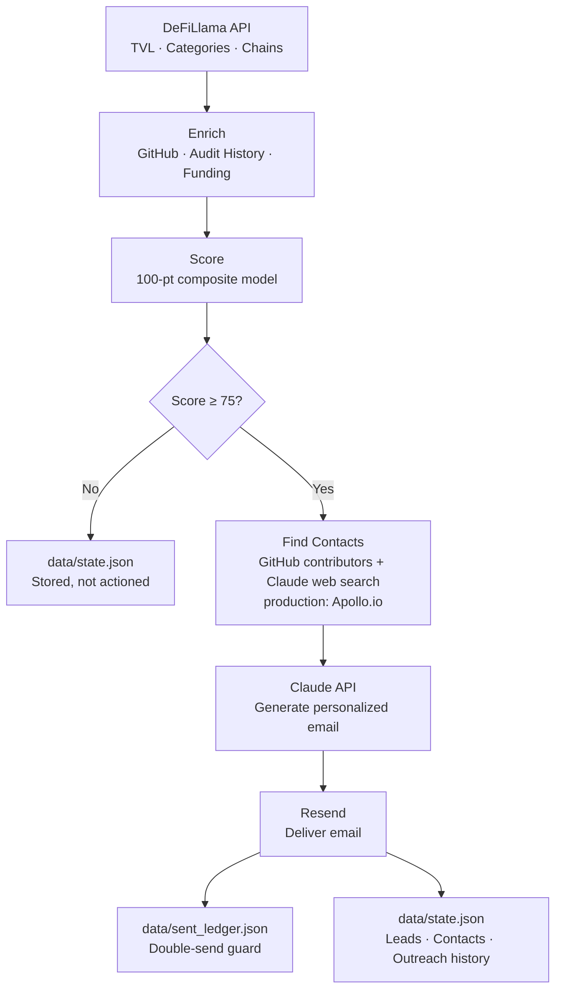

#  Discovery Pipeline

AI-powered GTM system for Web3 security sales. Discovers, scores, and reaches out to Web3 protocols most likely to need Web3 security services — security competitions, continuous AI code monitoring, and managed bug bounties. Can be extended to Web2 security as well.

---

## The Hypothesis

Web3 engineering teams are using Copilot, Cursor, and Claude Code to write Solidity and Rust smart contracts faster than ever. But AI-generated smart contract code is uniquely dangerous — a single vulnerability means **immediate, irreversible loss of funds**. Traditional audit cycles can't keep pace with AI-accelerated shipping. A security platform — combining continuous AI code analysis, a large independent researcher network, competitions, and bug bounties — is built for this velocity.

**Why Hypothesis A over B:** Hypothesis A is a survival problem (get exploited or don't). Hypothesis B (tool consolidation) is an efficiency problem. Urgency books discovery calls.

---

## What It Does

1. **Ingest** — Pulls live protocol data from DeFiLlama (TVL, categories, chains)
2. **Enrich** — Fetches GitHub activity, audit history, funding, and team signals
3. **Score** — Weighted composite scoring across 5 signals (TVL, audit status, shipping velocity, funding recency, reachability)
4. **Contact enrichment** — Finds founders, CTOs, and security leads via GitHub contributors + Claude web search
5. **Outreach** — Generates personalized cold emails via Claude API, one per person found
6. **Send** — Delivers emails via Resend
7. **Persist** — Saves leads, contacts, and outreach history to `data/state.json`



---

## Architecture

```
discovery-pipeline/
├── frontend/              Next.js UI — chat + lead dashboard + draft drawer
├── scripts/
│   ├── api.py             FastAPI backend — all REST endpoints + LangChain agent
│   └── run_pipeline.py    Standalone CLI pipeline runner
├── src/
│   ├── pipeline/          ingest → enrich → score
│   ├── agents/            outreach_agent.py (Claude email generation), signal_agent.py
│   ├── integrations/      email_sender.py, contacts.py
│   ├── monitoring/        event_monitor.py (DeFiLlama exploit/funding detection)
│   ├── store/             json_store.py (data/state.json + send ledger)
│   └── utils/             claude_client.py, config.py, json_utils.py, token_tracker.py
├── config/
│   ├── scoring_weights.json   ICP definition — all scoring rules and discovery settings
│   └── .env.example           API keys and secrets template
└── docs/
    └── images/               Screenshots of the working system
```

---

## Tech Stack

| Layer | Technology |
|-------|-----------|
| Pipeline | Python 3.11+ |
| Web API | FastAPI + Uvicorn |
| Frontend | Next.js 14 (App Router) + Tailwind |
| Persistence | Local JSON (`data/state.json`) |
| AI / LLM | Claude API (Anthropic SDK) |
| Agents | LangChain ReAct |
| Email | Resend |
| Monitoring | DeFiLlama hacks/funding APIs |

---

## Scoring Model

100-point composite score across 5 signals:

| Signal | Max pts | Logic |
|--------|---------|-------|
| TVL / funds at risk | 30 | >$1B = 30, $100M–$1B = 25, $10M–$100M = 20 |
| Audit status | 25 | Never audited = 25, stale = 22, shipping unaudited code = 20 |
| Shipping velocity | 20 | Daily commits + weekly deploys = 20 |
| Funding recency | 15 | Raised in last 3 months = 15 |
| Reachability | 10 | Warm intro = 10, doxxed + active Twitter = 8 |

**Tiers:** Hot ≥ 90 · Warm 75–89 · Cool < 75

All thresholds and weights live in `config/scoring_weights.json` — no code changes needed to tune the ICP.

---

## Setup

### 1. Python dependencies

```bash
cd discovery-pipeline
pip install -r requirements.txt
```

### 2. Environment variables

```bash
cp config/.env.example config/.env
# Fill in your keys
```

Required:
- `ANTHROPIC_API_KEY` — Claude API (outreach generation + contact search)

Optional but recommended:
- `GITHUB_TOKEN` — raises GitHub rate limit from 60 to 5000 req/hr
- `RESEND_API_KEY` + `RESEND_FROM_EMAIL` — send outreach emails
- `RESEND_TEST_EMAIL` — redirect all emails to one address during testing

---

### 3. Frontend

```bash
cd discovery-pipeline/frontend
npm install
npm run dev
```

### 4. Backend API

```bash
uvicorn scripts.api:app --port 8000 --reload
```

Once running, the interactive API docs are available at `http://localhost:8000/docs` — all endpoints are listed and callable directly from the browser.

---

## Running the Pipeline

Open `http://localhost:3000` — click **Run Pipeline** in the UI or chat with the agent.

The pipeline runs fully from the UI. No CLI needed.

| URL | What it is |
|-----|-----------|
| `http://localhost:3000` | Next.js UI — lead dashboard, chat agent, draft drawer |
| `http://localhost:8000/docs` | FastAPI interactive docs — all REST endpoints |

### Testing a Reply

To simulate a prospect replying, use the `POST /api/outreach/replied` endpoint directly from `http://localhost:8000/docs`:

```json
{
  "protocol_name": "Ethena",
  "persona_name": "Guy Young",
  "reply_body": "Thanks for reaching out, happy to chat."
}
```

This does one thing:
1. **`data/state.json`** — outreach status updated to `replied`, with the reply body stored alongside the original message

### Pipeline Results


### Email Drafted


### Email Delivered


---

## Chat Agent

The UI includes a LangChain-powered agent (Claude) with tools:

| Tool | What it does |
|------|-------------|
| `get_pipeline_results` | List scored leads with tier filter |
| `get_outreach_draft` | Show all drafted emails for a protocol |
| `get_pipeline_summary` | High-level counts and top leads |
| `get_contacts` | Show contacts found for a protocol |
| `run_market_monitor` | Check DeFiLlama for exploits and funding rounds |

---

## Configuration

All ICP and scoring settings are in `config/scoring_weights.json`:

```json
"discovery": {
  "min_tvl_usd": 50000000,
  "max_qualified_leads": 3,
  "max_contacts_per_protocol": 3,
  "target_categories": ["Dexes", "Lending", "Yield", ...]
}
```

`max_qualified_leads` is capped at 3 for demo cost management. In production, raise this or remove the cap and let the score threshold filter naturally.

---

## Token Tracking

The UI header shows live token usage and estimated cost for the current session. Resets on page reload or via the reset button. Tracks both pipeline Claude calls and chat agent calls.

---

## Key Files

| File | Purpose |
|------|---------|
| `scripts/api.py` | FastAPI app, LangChain agent, all endpoints |
| `scripts/run_pipeline.py` | CLI orchestrator + `RESEARCH_OVERLAYS` seed data |
| `src/agents/outreach_agent.py` | Claude email generation + fallback templates |
| `src/integrations/contacts.py` | GitHub + Claude web search for contacts |
| `src/store/json_store.py` | JSON persistence + send ledger |
| `config/scoring_weights.json` | ICP definition — edit this to tune targeting |
| `frontend/src/app/page.tsx` | Main UI — chat, lead table, draft drawer |

---

## Instrumentation

If we book 10 discovery calls:

| Metric | Target |
|--------|--------|
| Booking rate | >15% |
| Hypothesis confirmation | >60% |
| Pain severity | ≥7/10 avg |
| AI for contracts confirmed | Track % |
| Next-step conversion | >50% |

**Confirmed signal at Day 30:** 6+ of 10 calls confirm AI code security gaps, severity ≥7/10, 3+ convert to next step → scale the pipeline.

---


